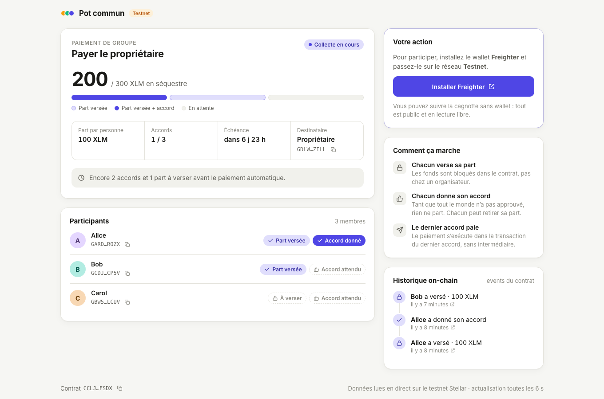
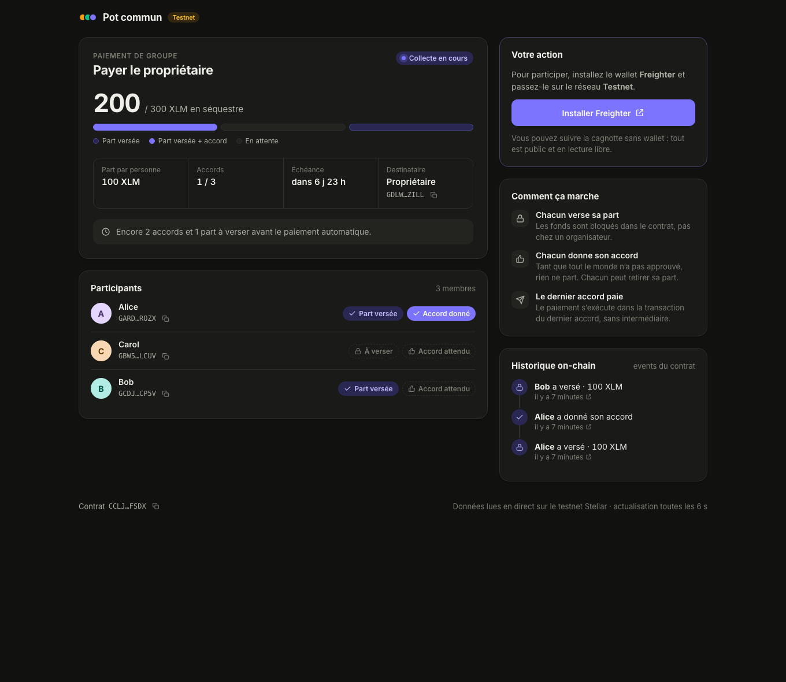

# Pot commun — paiement de groupe trustless sur Stellar

Un smart contract Soroban où chaque participant **verse sa part**, puis **donne son accord**.
Quand le dernier accord arrive, le contrat **paie automatiquement** le destinataire, dans la même transaction.
Tant que le paiement n'est pas parti, chacun peut **retirer** sa part.

## Aperçu



<details><summary>Thème sombre</summary>



</details>

## Structure

- `contracts/group_payment/` : le contrat d'un pot (Rust, `soroban-sdk` 28) et ses tests
- `contracts/pot_factory/` : le registre qui crée les pots et indexe les invitations
- `frontend/` : l'interface web (Vite + React + TypeScript, Stellar Wallets Kit : Freighter, xBull, Lobstr, Albedo, Hana, Rabet)

## Déploiement testnet actuel

| | |
|---|---|
| Registre | [`CCDGM7OXGZU3KRUYJ7H6OC5HRYUL4NTICV3ZABPZI6VEJOO3OUYQPDBX`](https://stellar.expert/explorer/testnet/contract/CCDGM7OXGZU3KRUYJ7H6OC5HRYUL4NTICV3ZABPZI6VEJOO3OUYQPDBX) |
| Pot de démo (terminé) | [`CCLJZERI6DO2FCXCSMYR5VAHBTFGX5HFKRQEVJRXTDREIXT2VAQOFSDX`](https://stellar.expert/explorer/testnet/contract/CCLJZERI6DO2FCXCSMYR5VAHBTFGX5HFKRQEVJRXTDREIXT2VAQOFSDX) |
| Wasm d'un pot | `bcdd75410d8f2c8fb780009fab565bbdfba90cb4cf2b84bd2b9fcc31add1aa94` |
| Token | XLM natif (SAC `CDLZFC3SYJYDZT7K67VZ75HPJVIEUVNIXF47ZG2FB2RMQQVU2HHGCYSC`) |

## Contrat

```bash
stellar contract build    # → target/wasm32v1-none/release/{group_payment,pot_factory}.wasm
cargo test                # les tests du registre utilisent le Wasm du pot : builder d'abord
```

| Fonction | Rôle |
|---|---|
| `__constructor(token, recipient, participants, amount, deadline)` | Fixe les règles une fois pour toutes |
| `contribute(from)` | Verse la part de `from` dans le contrat (séquestre) |
| `approve(from)` | Donne l'accord de `from` ; le dernier accord déclenche le paiement |
| `withdraw(from)` | Rend la part de `from` et annule son accord (tant que le paiement n'est pas parti) |
| `get_config`, `get_status`, `get_participants`, `get_participant`, `get_approval_count` | Lecture |

### Registre (`pot_factory`)

| Fonction | Rôle |
|---|---|
| `create_pot(owner, title, participants, amount, deadline)` | Déploie un pot dont `owner` est le destinataire, et y invite `participants` |
| `list(start, limit)`, `get_pot(id)`, `count()` | Parcourir les pots |
| `pots_of(member)` | Les pots d'une adresse (propriétaire ou invitée) : la source des invitations |

Déployer le registre (le Wasm du pot doit déjà être uploadé : `stellar contract upload`) :

```bash
stellar contract deploy --wasm target/wasm32v1-none/release/pot_factory.wasm \
  --source-account alice --network testnet -- \
  --pot_wasm_hash <hash du Wasm group_payment> \
  --token $(stellar contract id asset --asset native --network testnet)
```

Déployer un pot seul, sans le registre :

```bash
stellar contract deploy --wasm target/wasm32v1-none/release/group_payment.wasm \
  --source-account alice --network testnet -- \
  --token $(stellar contract id asset --asset native --network testnet) \
  --recipient <G...> --participants '["G...","G..."]' \
  --amount 1000000000 --deadline $(date -v+7d +%s)
```

## Frontend

```bash
cd frontend
pnpm install
pnpm dev
```

Les adresses se règlent dans `frontend/.env` (`VITE_FACTORY_ID`, `VITE_DEMO_POT_ID`).
Pour agir en tant que participant de démo, importez sa clé dans votre wallet (réseau Testnet) : `stellar keys secret bob`.

> Projet d'apprentissage, non audité : ne pas utiliser sur le mainnet en l'état.
